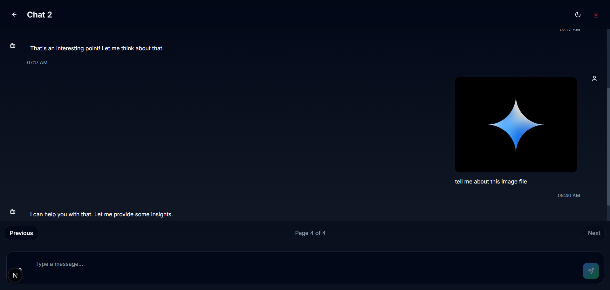
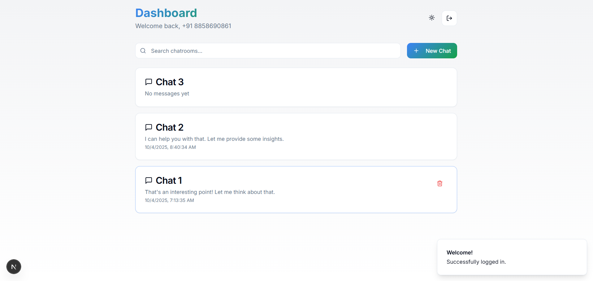
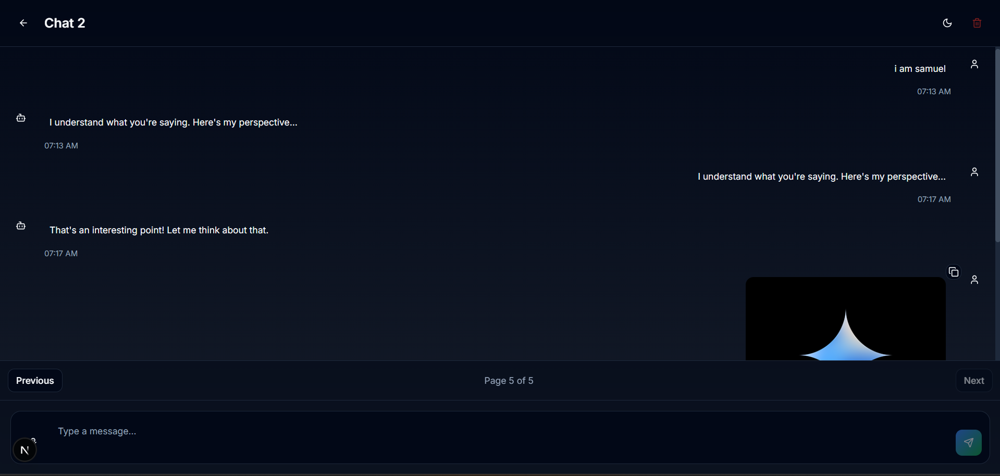
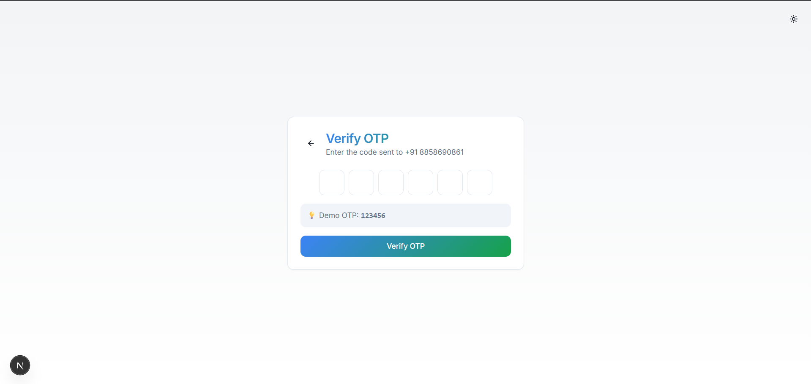

# Gemini Chat Clone

A modern, feature-rich chat application inspired by Google's Gemini AI interface. Built with React, TypeScript, and Tailwind CSS, featuring advanced functionality like infinite scroll, client-side pagination, input throttling, and form validation.

## 🔗 Live Demo

**[View Live Application](https://gemini-cyan-theta.vercel.app/)**

## UI Screenshot






## 📋 Project Overview

This project is a full-featured chat application that replicates the core functionality of Google's Gemini AI chat interface. It includes:

- **Phone-based Authentication**: Secure login with OTP verification
- **Multiple Chat Rooms**: Create and manage separate conversation threads
- **Real-time Messaging**: Chat with AI responses and typing indicators
- **Infinite Scroll**: Load older messages seamlessly as you scroll
- **Client-side Pagination**: Navigate through messages with page controls
- **Input Throttling**: Optimized input handling with debouncing
- **Form Validation**: Robust validation using Zod schema
- **Dark/Light Mode**: Full theme support with system preference detection

## 🚀 Setup and Run Instructions

### Prerequisites

- Node.js (v18 or higher)
- npm or bun package manager

### Installation

1. **Clone the repository**
   ```bash
   git clone https://github.com/SamuelMasih777/gemini.git
   cd gemini
   ```

2. **Install dependencies**
   ```bash
   npm install
   # or
   bun install
   ```

3. **Start the development server**
   ```bash
   npm run dev
   # or
   bun dev
   ```

4. **Open your browser**
   ```
   Navigate to http://localhost:3000
   ```

### Build for Production

```bash
npm run build
npm run preview
```

## 📁 Folder/Component Structure

```
│
├── src/
│   ├── app/
│   │   ├── auth/page.tsx            # Authentication page
│   │   ├── chat/[id]/page.tsx       # Dynamic chat room page
│   │   ├── dashboard/page.tsx       # Dashboard with chat rooms
│   │   ├── globals.css              # Global styles
│   │   ├── layout.tsx               # Root layout
│   │   └── page.tsx                 # Home page
│   ├── components/
│   │   ├── auth/
│   │   │   ├── country-selector.tsx    # Country code selector
│   │   │   ├── otp-input.tsx          # OTP verification input
│   │   │   └── phone-input.tsx        # Phone number input with validation
│   │   │
│   │   ├── chat/
│   │   │   ├── message-input.tsx      # Message input with throttling
│   │   │   ├── message.tsx            # Message display component
│   │   │   └── typing-indicator.tsx   # AI typing animation
│   │   │
│   │   └── ui/                        # shadcn-ui components
│   │       ├── button.tsx
│   │       ├── input.tsx
│   │       ├── pagination.tsx         # Pagination controls
│   │       └── ... (other UI components)
│   │
│   ├── hooks/
│   │   ├── use-debounce.ts           # Debouncing hook for throttling
│   │   └── use-mobile.tsx            # Mobile detection hook
│   │
│   ├── store/
│   │   ├── auth-store.ts             # Authentication state (Zustand)
│   │   └── chat-store.ts             # Chat state with pagination & infinite scroll
│   │
│   ├── lib/
│   │   └── utils.ts                  # Utility functions
│
├── public/                           # Static assets
├── tailwind.config.ts               # Tailwind configuration
└── package.json                     # Packages
```

## 🎯 Key Features Implementation

### 1. Input Throttling (Debouncing)

**Location**: `src/hooks/use-debounce.ts` and `components/chat/message-input.tsx`

**Implementation**:
```typescript
// Custom debounce hook
export function useDebounce<T>(value: T, delay?: number): T {
  const [debouncedValue, setDebouncedValue] = useState<T>(value);

  useEffect(() => {
    const timer = setTimeout(() => setDebouncedValue(value), delay || 500);
    return () => clearTimeout(timer);
  }, [value, delay]);

  return debouncedValue;
}
```

**Usage**: The message input uses debouncing to prevent excessive re-renders and optimize performance when users type rapidly.

### 2. Client-side Pagination

**Location**: `store/chat-store.ts` and `app/chat/[id]/page.tsx`

**Implementation**:
- **State Management**: `currentPage` tracked per chatroom
- **Messages per Page**: 20 messages displayed at a time
- **Total Pages Calculation**: Dynamically calculated based on message count
- **Navigation**: Previous/Next buttons with page indicators

```typescript
// Store implementation
getPaginatedMessages: (chatroomId: string) => {
  const state = get();
  const messages = state.messages[chatroomId] || [];
  const currentPage = state.currentPage[chatroomId] || 1;
  const startIndex = (currentPage - 1) * state.messagesPerPage;
  const endIndex = startIndex + state.messagesPerPage;
  return messages.slice(startIndex, endIndex);
}
```

**Features**:
- Auto-navigation to last page when new messages arrive
- Page persistence per chatroom
- Visual page indicators (Page X of Y)

### 3. Infinite Scroll

**Location**: `app/chat/[id]/page.tsx` and `store/chat-store.ts`

**Implementation**:
- **Scroll Detection**: Monitors scroll position to detect when user reaches top
- **Load More**: Automatically loads 20 older messages when scrolling up
- **Scroll Position Preservation**: Maintains scroll position after loading
- **Manual Trigger**: "Load more messages" button available

```typescript
const handleScroll = () => {
  const container = messagesContainerRef.current;
  if (!container || !hasMore) return;

  if (container.scrollTop === 0) {
    const previousHeight = container.scrollHeight;
    loadMoreMessages(id);
    
    setTimeout(() => {
      if (container.scrollHeight === previousHeight) {
        setHasMore(false);
      } else {
        container.scrollTop = container.scrollHeight - previousHeight;
      }
    }, 100);
  }
};
```

**Features**:
- Works seamlessly with pagination
- Only active on the first page
- Prevents duplicate loading with `hasMore` state

### 4. Form Validation

**Location**: `components/auth/phone-input.tsx`

**Implementation**: Uses Zod schema for robust validation

```typescript
const phoneSchema = z.object({
  countryCode: z.string().min(1, "Country code is required"),
  phoneNumber: z.string()
    .min(10, "Phone number must be at least 10 digits")
    .max(15, "Phone number must not exceed 15 digits")
    .regex(/^[0-9]+$/, "Phone number must contain only digits")
});
```

**Features**:
- Client-side validation with real-time error messages
- Input length limits and character restrictions
- Country code validation
- Visual error indicators
- Prevents form submission with invalid data

## 🛠️ Technologies Used

- **React 18** - UI library
- **TypeScript** - Type safety
- **Vite** - Build tool and dev server
- **Tailwind CSS** - Utility-first CSS framework
- **shadcn-ui** - Component library
- **Zustand** - State management
- **Zod** - Schema validation
- **React Router** - Client-side routing
- **Lucide React** - Icons

## 🎨 Design System

The application uses a comprehensive design system with:
- Semantic color tokens (HSL-based)
- Dark/Light mode support
- Responsive layouts
- Consistent spacing and typography
- Custom animations and transitions

-By - Samuel Masih samuelmasih.sls777@gmail.com
